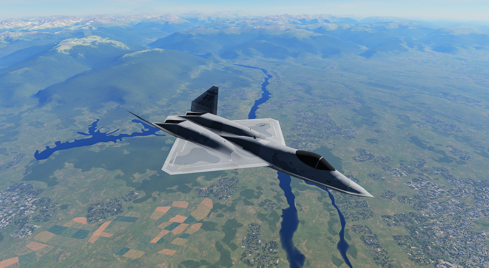

# F-23B Black Widow II

The full Hornet radar, datalink and SA page in a stealth airframe, with custom F-23 flight dynamics.
Internal bays open before weapon release. MALICE has a recorded **336-mile A-50 kill** with continuing target support.
AI F-23Bs fly and fight with MALICE and Block II. Current installs change **no DCS game files**.

## Get v1.4

Requires Windows and an installed, activated **DCS: F/A-18C Hornet**.
The weapon and radar connection supports **DCS 2.9.30.28738**.
Single-player; VR and multiplayer not yet tested.

| Method | Download |
| --- | --- |
| Copy and paste | [F-23B-v1.4.zip](https://github.com/Coaokalo/f23b-public/releases/latest/download/F-23B-v1.4.zip) |
| Installer | [F-23B-v1.4-Setup.exe](https://github.com/Coaokalo/f23b-public/releases/latest/download/F-23B-v1.4-Setup.exe), which does the same thing for you |

Both include the same aircraft, weapons, ten liveries and documentation.

**Manual install**

- Close DCS.
- Extract the ZIP and drag its contents into `Saved Games\DCS`.

**Manual upgrade**

- Close DCS and delete `Mods\aircraft\F-23B` and `Mods\aircraft\F-23B-Player` first.
- Copy the extracted contents into the same profile.

**Manual removal**

- Close DCS and delete those two aircraft folders.
- Delete the ten supplied `F23B-...` folders in `Liveries\F-23B` and, optionally, `F-23B-docs`.

**September 17/18 users:** run DCS Repair with **Check all files (slow)** once before your first manual upgrade.
Those releases changed stock game files. Copying a ZIP cannot restore them.
See [the exact steps and method switching](INSTALL.md).

For setup, close DCS, run the EXE, confirm both folders, then select **Install / Repair**.
Start an **F-23B Quick Start** mission. Your first flight uses the Langley livery and your Hornet controls.

[Illustrated pilot guide](docs/PILOT_GUIDE.md) ·
[Release details](https://github.com/Coaokalo/f23b-public/releases/latest) ·
[Feedback and questions](https://github.com/Coaokalo/f23b-public/discussions)

## In the aircraft

- Native Hornet radar, MSI, datalink, SA, EW and RWR, with a 640 NM SA scale.
- Sequenced internal bays, AIM-424 MALICE with loft control and a second motor pulse, and project AIM-9X Block II.
- Friendly-track selection protection and AI weapon use.
- Ground and water collision, speed-limited nosewheel steering, and a stiffer nose strut.
- One canopy frame in the pilot view, exterior lights, and the accepted new afterburner visuals.
- Ten liveries: four USAF schemes, two heritage schemes, Crimson Widow, Arctic Splinter, Desert Aggressor and NASA Research.

## FAQ

**Do I need the Hornet?** Yes. It must be installed and activated. The download does not contain its proprietary files.

**What happens after a DCS update?** Installation remains available. If the connection cannot start, an in-game message says **connection OFF**.
Custom weapons, radar upgrades and SA 640 are then unavailable. Flight, the native cockpit and radar, bays, lights and liveries remain available.
Use [a compatible release](https://github.com/Coaokalo/f23b-public/releases/latest).

**Multiplayer or VR?** Single-player; VR and multiplayer not yet tested.

**Windows warns about the unsigned installer.** Use the ZIP.

**How do I remove it?** Delete the two aircraft folders and supplied liveries, or select **Remove** in setup.

**Where are the liveries?** Choose an `F-23B |` scheme in the mission editor or rearming menu. All ten are included.

## Limits and licences

The 336-mile kill is one supported flight, not a guaranteed launch range. Exact 350-mile shots remain unverified.
MALICE's coasting-apex estimate is not a hard altitude cap. Block II helmet cueing and post-launch datalink are not implemented.
AI uses the extended MALICE energy profile when the player also flies an F-23B.
See [known limitations](KNOWN_ISSUES.md).

The combined software uses **GPL-3.0-or-later**, with retained file-level MIT grants.
Original documentation and eligible original creative content use **CC BY-SA 4.0**.
Purchased models and derived textures retain separate asset terms.
Credits: **Grinnelli Designs and Branden Hooper** for flight-model source; **SytaPastel** for the licensed YF-23 visual source.

[Software licence](LICENSE) · [Asset terms](LICENSE-ASSETS.md) · [Third-party notices](THIRD_PARTY_NOTICES.md) ·
[Report a bug](https://github.com/Coaokalo/f23b-public/issues/new?template=bug_report.yml)

[Build and test](BUILDING.md) · [Source layout](docs/SOURCE_LAYOUT.md) · [Contributing](CONTRIBUTING.md)

The release includes the corresponding software source archive and SHA-256 checksums.
The [September 29 release](https://github.com/Coaokalo/f23b-public/releases/tag/release-2026-09-29) remains available for DCS 2.9.29.27468.

THIS MATERIAL IS NOT MADE OR SUPPORTED BY EAGLE DYNAMICS SA.
