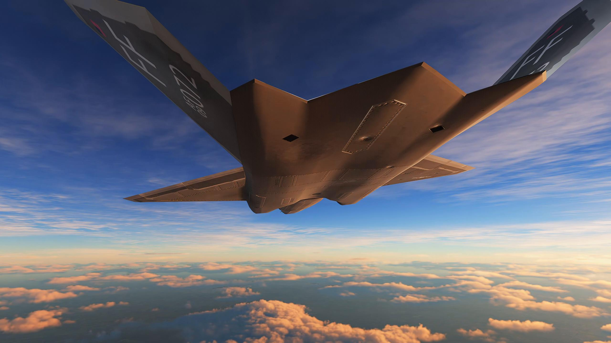
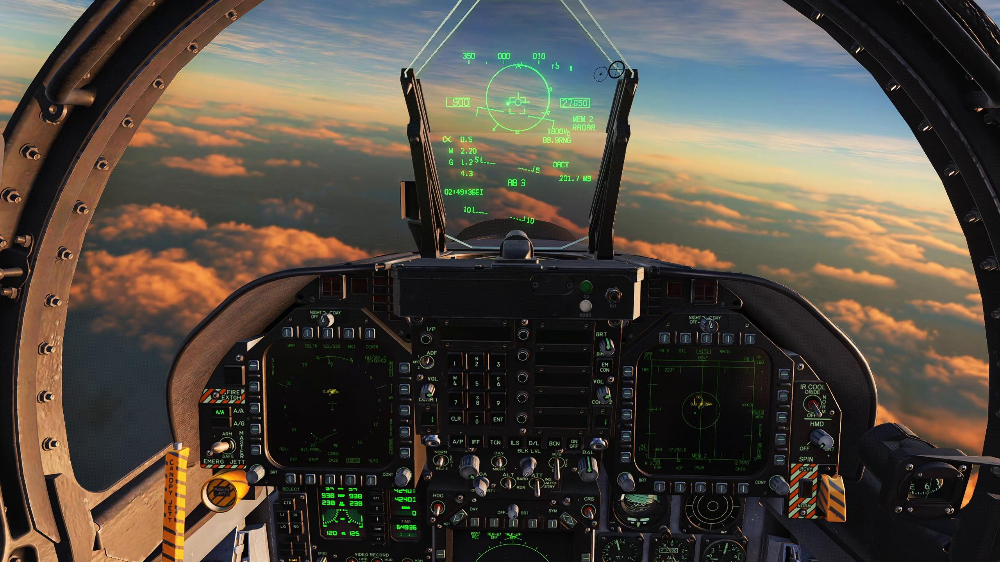

# F-23B Black Widow II — experimental preview for DCS World

The F-23B brings the Black Widow airframe to DCS with a custom flight model,
the F/A-18C Hornet cockpit and avionics, and internal weapon bays carrying
MALICE and project AIM-9X Block II. The preview includes exterior lighting,
afterburner effects, and three Caucasus Quick Start missions to get flying.

**Requires Windows, DCS 2.9.29.27468, an installed and activated F/A-18C Hornet,
and Python 3.11+.** Install both aircraft folders and the included missile patch.
The patch changes AIM-120B and AIM-9X globally and may affect other aircraft
and multiplayer integrity checks; undo instructions are included.

This is an experimental preview for single-player use. Feedback and reproducible
bug reports will help shape the next update.

**[Download](https://github.com/Coaokalo/f23b-public/releases)** ·
[Install & remove](https://github.com/Coaokalo/f23b-public/blob/main/INSTALL.md) ·
[Known limitations](https://github.com/Coaokalo/f23b-public/blob/main/KNOWN_ISSUES.md) ·
[Report a bug](https://github.com/Coaokalo/f23b-public/issues/new?template=bug_report.yml)

*DCS development captures; small visual details may differ from this preview.*

THIS MATERIAL IS NOT MADE OR SUPPORTED BY EAGLE DYNAMICS SA.
