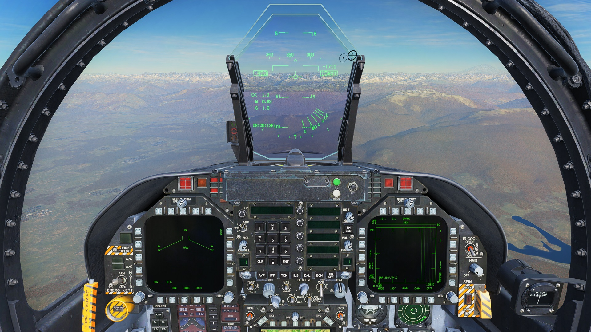

# F-23B v1.4 — pilot guide

[Download the one-page printable guide](https://github.com/Coaokalo/f23b-public/releases/latest/download/F-23B-v1.4-Pilot-Guide.html).
Open it in a browser and select Print.

| Step | Action |
| --- | --- |
| Arm | Use your Hornet controls. Set MASTER ARM to ARM and select A/A. |
| Select | Select AMRAAM for MALICE, or Sidewinder for Block II. The Hornet display retains those labels. |
| Fire | Press the trigger. The correct bay opens, the weapon fires, then the bay closes. A brief press queues the sequence. |
| MALICE | Designate a valid radar or supported network target. Maintain target updates through midcourse. The second pulse starts at seeker search. |
| Block II | Enable IR cooling and obtain a seeker lock before firing. Helmet cueing and post-launch datalink are not implemented. |
| SA scale | Open SA on a DDI. Press SCL to cycle through the available scales, including 640 NM (about 737 miles). |
| Ground | Use small steering inputs. Steering authority reduces with speed. Use rudder and differential braking at higher speeds. |

MALICE has a recorded 336-mile A-50 kill with continuing support. Range depends on launch height, speed, target motion and support.
The bay sequence also operates the gun door. Do not bypass it with donor trigger mappings.
If **weapon and radar connection OFF** appears, get a compatible release before using custom weapons or SA 640.

Single-player; VR and multiplayer not yet tested.
[Installation](../INSTALL.md) · [Feedback](https://github.com/Coaokalo/f23b-public/discussions)
